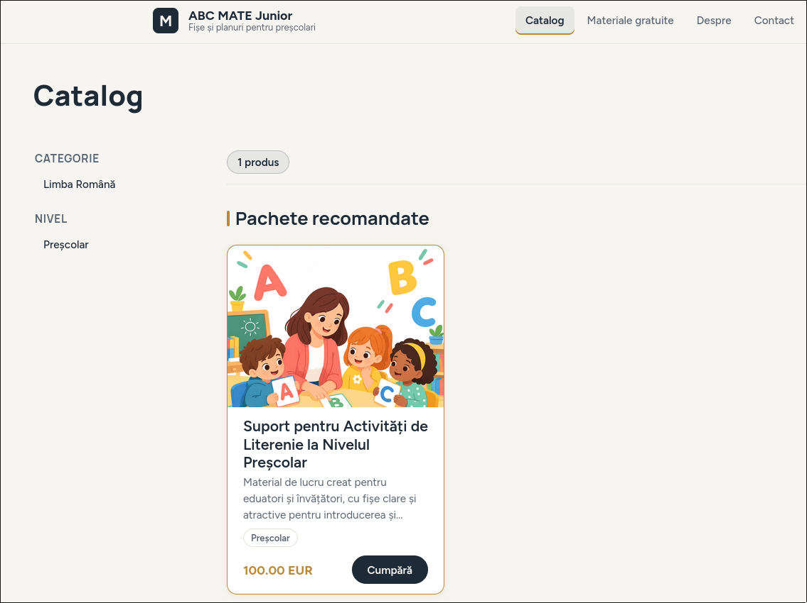
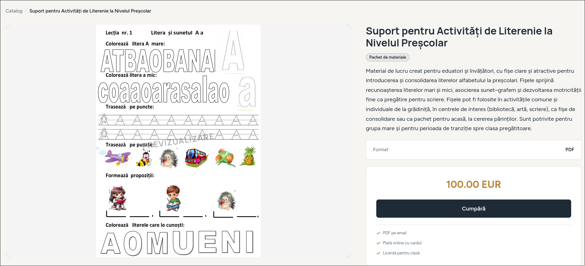
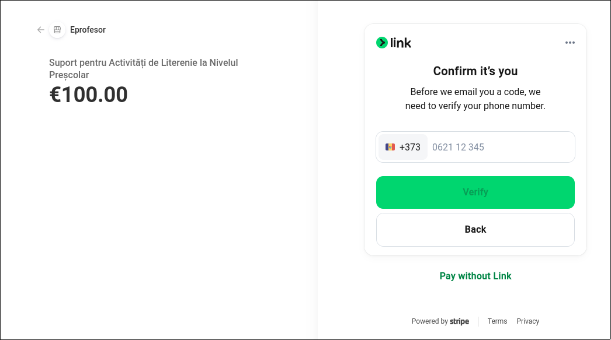
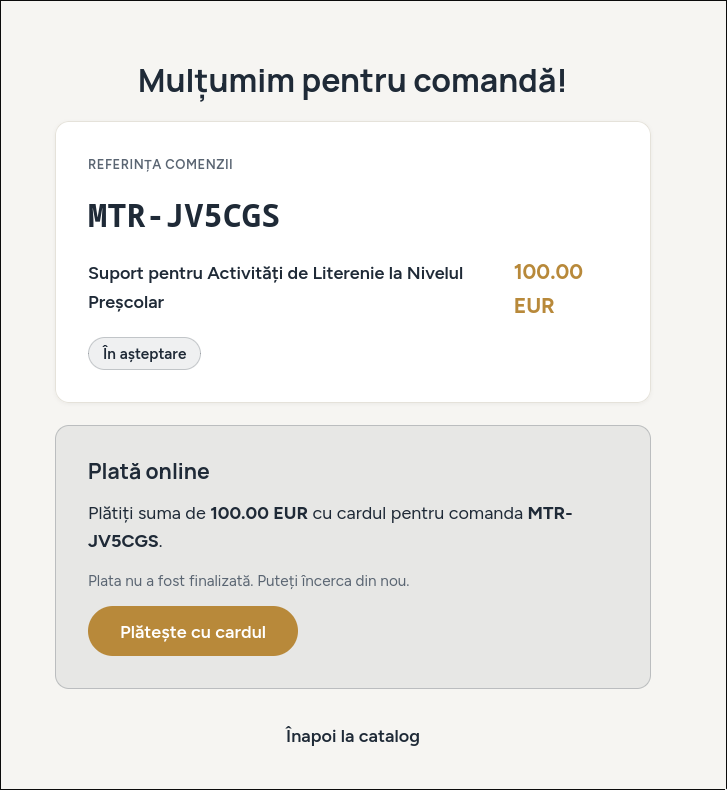
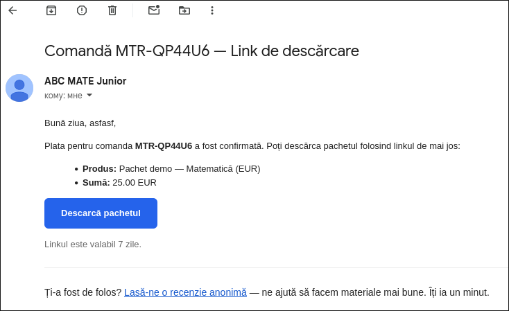

# ABC MATE Junior

E-commerce site for digital teaching materials, live at
[abcmatejunior.com](https://abcmatejunior.com). A primary-school teacher sells
her worksheets, lesson plans and activity packs there. Teachers buy without
creating an account and receive the PDF (or a ZIP for bundles) by email after
payment.

I built this end to end and I operate it in production: Django 5 backend,
React 18 frontend, PostgreSQL 16, deployed with Docker Compose and Caddy
on a Hetzner VPS.

> Source is private. This repository is a showcase — available on request.

## Screenshots

## Purchase flow

1. The buyer picks a material or a bundle and fills in name and email.
2. Bundles (EUR) are paid through Stripe Checkout. Individual materials (MDL)
   follow the same order flow with offline payment and manual confirmation
   from the admin dashboard.
3. Once an order is marked paid, the buyer automatically receives an email
   with a signed download link valid for 7 days.
4. Download links are signed tokens, so files cannot be hotlinked or shared
   permanently.
5. After delivery, the buyer can leave an anonymous review about the material.

## Data model and API

- **Material** — UUID, slug, category, school level, price + currency, PDF
  file, cover image, published flag.
- **Bundle** — M2M collection of materials, EUR price, derived levels and
  categories from its materials.
- **Order** — unique reference (`MTR-XXXXXX`), buyer name/email, status
  (pending / paid / cancelled), signed download token, ZIP link for bundles,
  download counter, payment timestamp.

Public API: browse published materials and bundles with category and level
filters, create an order, download by token.
Admin API: dashboard statistics, material and bundle CRUD, order management
(mark paid, resend download email, cancel).

## Why Stripe and not a local gateway

Stripe does not operate in Moldova, and local card gateways such as
Moldindconbank iPay require a registered business. So the payments layer is a
pluggable Django app: EUR bundles use Stripe Checkout today, the same order
flow supports offline payment methods with manual confirmation, and switching
to a local card gateway later is a drop-in module rather than a rewrite.

## Security and operations

- Rate-limited admin login, CSRF protection, session timeouts
- fail2ban and Sentry monitoring on the server
- GDPR-aware handling of buyer data, cookie consent, error boundaries
- Caddy automatic HTTPS, scheduled database backups

## Testing

- Playwright end-to-end tests covering the purchase flow
- Unit tests per page (home, product detail, order form, review,
  confirmation, free materials)
- GitHub Actions runs the suite on every push

## Stack

Django 5 · DRF · PostgreSQL 16 · React 18 (Vite) · Stripe · Resend ·
Docker Compose · Caddy · Hetzner VPS · GitHub Actions · Playwright · Vitest ·
Sentry · fail2ban
